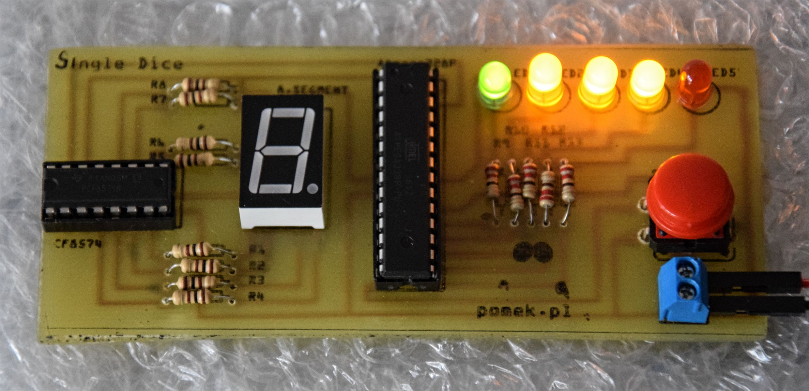
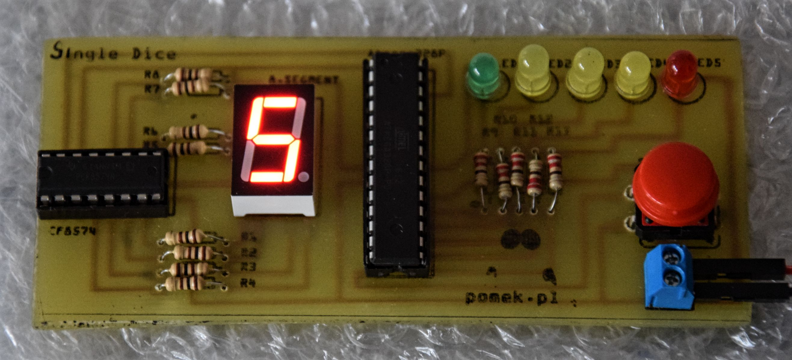
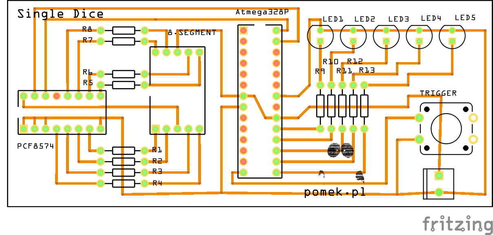

# SingleDice

Simple project which allows generating a random number from 1 to 6. 
The whole program is asynchronous. It means during the draw, you can 
do additional stuff.

If you want to introduce some changes, there is a `SingleDice.fzz` file which contains the schemes.
All you need to have is [Fritzing](http://fritzing.org/home/).
